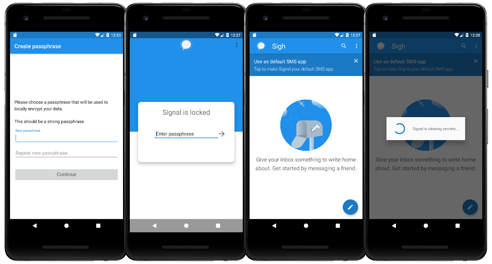

# sigH Android

A fork of [Signal Android](https://github.com/signalapp/Signal-Android) that encrypts app data and keys with a passphrase.

Some time ago, Signal supported user passphrase for securing data on disk independently of [Android FDE](https://source.android.com/security/encryption/full-disk). But this option was deliberately removed ([#7553](https://github.com/signalapp/Signal-Android/issues/7553)). Now we bring it back again with some additional security features.

## Features

* Screen is locked with **user passphrase**.
* **Database**, identity keys and persistent jobs are **encrypted** with the master secret.
* **Master secret** is encrypted and authenticated with user passphrase.
* The app is **auto-locked** after 15 minutes of inactivity. Because clearing secrets from memory is hard in Android, the underlying JVM process is **killed and respawned** on lock. It is expected that other processes will overwrite that freed memory in a short time.
* Local encryption is upgraded to **AES-256** and **SHA-256**.
* **Privacy settings** are enabled by default.

## FAQ

### Q: How does Signal protect data at rest?

Signal encrypts data on the device but it stores the encryption key in the [KeyStore](https://developer.android.com/training/articles/keystore).

Signal screen lock is just a screen lock not connected with any kind of encryption.

Identity key pair is stored in plain text in [Preferences](https://developer.android.com/training/data-storage/shared-preferences).

### Q: Can I install it along with Signal?

Yes, you can install and run both apps on the same device. The app identifier was changed to **sigH** so they will not share storage or configuration.

### Q: Can the app receive messages while locked?

Yes, messages will be queued in the server until you enter your passphrase.

Notifications are not displayed while locked. Android will still try to wake up the app every time a push notification is received, but as long as the content cannot be decrypted it will be ignored.

## Bugs

Database migrations for older versions were removed.

Master secret and database encryption key are never rotated. Changing your password will NOT rotate them.

## Disclaimer

License and legal notices in the original [README](README-ORIG.md).

For educational and informational purposes only.
